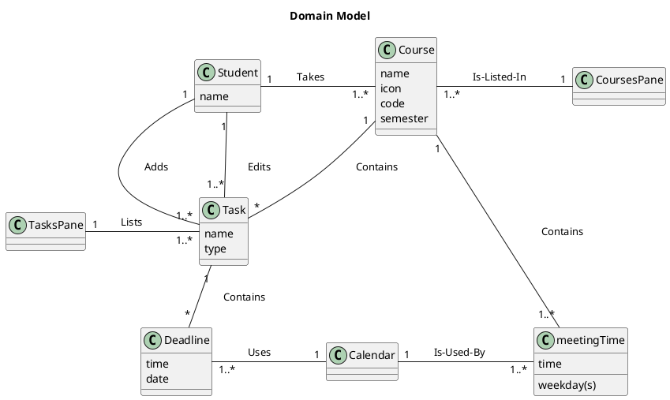

##Domain Model

```plantuml
@startuml
title Domain Model


'classes
class Course{
name
icon
code
semester
}
class meetingTime{
time
weekday(s)
}

class Task{
name
type
}
class Deadline{
time
date
}
class Student{
name
}
class TasksPane{
}
class CoursesPane{
}
class Calendar{
}


'associations
 Student "1" - "1..*" Course : \tTakes\t\t
 Course "1" -down- "*" Task : \tContains\t\t
 Course "1" - "1..*" meetingTime : \tContains\t\t
 Student "1" - "1..*" Task : \tAdds\t\t
 Student "1" - "1..*" Task : \tEdits\t\t
 Task "1" -down- "*" Deadline : \tContains\t\t
 Calendar "1" -left- "1..*" Deadline : \tUses\t\t
 Calendar "1" - "1..*" meetingTime : \tIs-Used-By\t\t
 Task "1..*" -left- "1" TasksPane : \tLists\t\t
 Course "1..*" -right- "1" CoursesPane : \tIs-Listed-In\t\t
@enduml
```