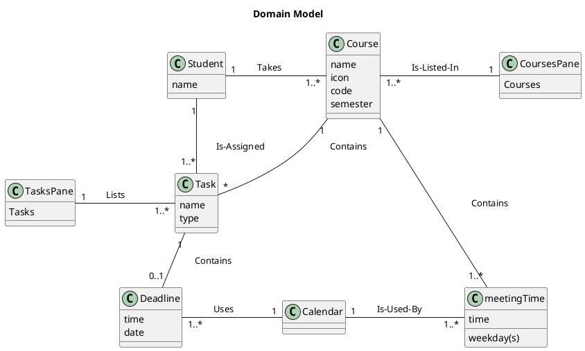
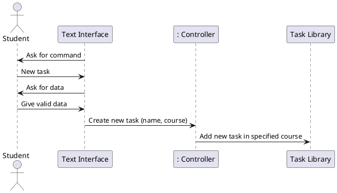
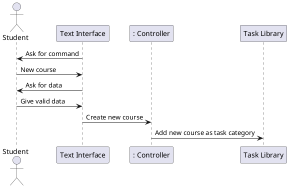

# Domain Model For Planner App

```plantuml
@startuml
title Domain Model


'classes
class Course{
name
icon
code
semester
}
class meetingTime{
time
weekday(s)
}

class Task{
name
type
}
class Deadline{
time
date
}
class Student{
name
}
class TasksPane{
Tasks
}
class CoursesPane{
Courses
}
class Calendar{
}


'associations
 Student "1" - "1..*" Course : \tTakes\t\t
 Course "1" -down- "*" Task : \tContains\t\t
 Course "1" - "1..*" meetingTime : \tContains\t\t
 Student "1" - "1..*" Task : \tIs-Assigned\t\t
 Task "1" -down- "0..1" Deadline : \tContains\t\t
 Calendar "1" -left- "1..*" Deadline : \tUses\t\t
 Calendar "1" - "1..*" meetingTime : \tIs-Used-By\t\t
 Task "1..*" -left- "1" TasksPane : \tLists\t\t
 Course "1..*" -right- "1" CoursesPane : \tIs-Listed-In\t\t
@enduml
```

# Sequence Diagrams For Planner App
## "Add Task" operation

```plantuml
@startuml
actor Student as student
participant "Text Interface" as textInterface
participant ": Controller" as controller
participant "Task Library" as taskLibrary
textInterface -> student: Ask for command 
student -> textInterface: New task
textInterface -> student : Ask for data
student -> textInterface: Give valid data
textInterface -> controller: Create new task (name, course)
controller -> taskLibrary: Add new task in specified course
@enduml
```

## "Add Course" operation

```plantuml
@startuml
actor Student as student
participant "Text Interface" as textInterface
participant ": Controller" as controller
participant "Task Library" as taskLibrary
textInterface -> student: Ask for command 
student -> textInterface: New course
textInterface -> student : Ask for data
student -> textInterface: Give valid data
textInterface -> controller: Create new course
controller -> taskLibrary: Add new course as task category
@enduml
```

# Class Diagram for Planner App

### TODO